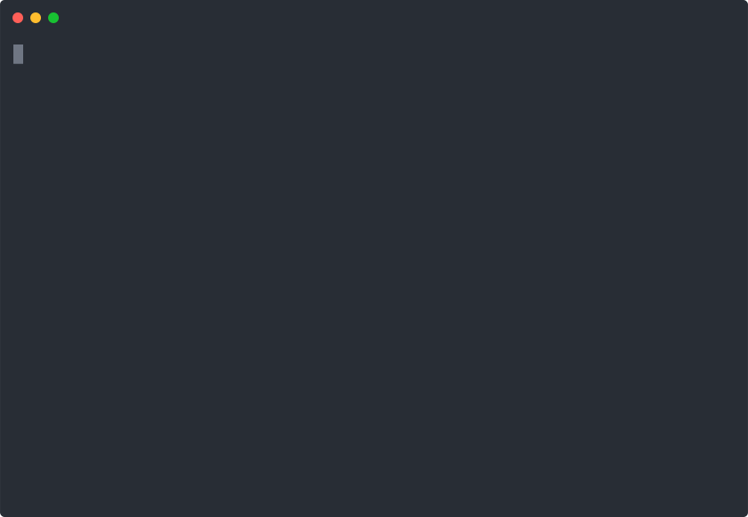

<h1 align="center">🔋 Agentic Energy Grid Balancer</h1>
<p align="center"><b>Autonomous Multi-Agent Energy Market Simulation with LLM-Driven Bidding</b></p>

<p align="center"><sub>FastAPI · SQLAlchemy · NumPy · SciPy · Docker · pytest · Ollama</sub></p>

<p align="center">
  
  
  
  
  
  
  
  
  
  
  
</p>

---

Autonomous energy agents (solar, wind, coal, nuclear, battery, consumer) compete in a double-sided auction market. Each agent uses an LLM to formulate hourly bidding strategy, a **uniform-price auction engine** clears supply and demand with carbon pricing, and **regulatory guardrails** enforce frequency stability and emissions caps.

---

## 📋 Table of Contents

- [Why This Matters](#-why-this-matters)
- [Architecture](#-architecture)
  - [Agentic AI Criteria](#1-agentic-ai-criteria)
  - [Neuro-Symbolic Paradigm](#2-neuro-symbolic-paradigm)
  - [Market Clearing Algorithm](#3-the-market-clearing-algorithm)
- [Quick Start](#-quick-start)
  - [Docker](#docker-recommended)
  - [Local Development](#local-development)
  - [Run the Architecture Trace](#run-the-architecture-trace)
  - [Using Ollama for Real LLM Inference](#using-ollama-for-real-llm-inference)
- [How It Works](#-how-it-works)
- [Testing](#-testing)
- [Tech Stack](#-tech-stack)
- [API Endpoints](#-api-endpoints)
- [Neuro-Symbolic Architecture Trace](#-neuro-symbolic-architecture-trace)
- [Future Integration](#-future-integration)
- [Contributing](#-contributing)
- [License](#-license)

---

## 💡 Why This Matters

| Problem | Impact |
|:--------|:-------|
| **Renewable intermittency** causes frequency instability | Battery arbitrage + orchestrator guardrails stabilize the grid |
| **Carbon emissions** go unpriced in wholesale markets | Carbon-priced auction internalizes the externality |
| **Grid operators** rely on manual dispatch decisions | Autonomous LLM agents discover dynamic bidding strategies |
| **Market power** can distort wholesale electricity prices | Double-sided auction with many agents ensures competitive pricing |

This project simulates how rational, LLM-powered energy agents *should* bid in a carbon-constrained wholesale market, then validates outcomes against physical grid constraints and regulatory caps.

### Use Cases

- **Grid R&D** — Test bidding algorithms and market designs before deployment
- **Energy economics** — Analyze how carbon pricing affects generator dispatch order
- **Education** — Interactive demonstration of double-sided auction clearing with LLM reasoning
- **Portfolio piece** — Live neuro-symbolic architecture trace showing neural failure → symbolic guardrail recovery

---

## 🏗️ Architecture

**Classification: Type 2 (Symbolic[Neuro]) per Kautz Taxonomy**

```
Symbolic orchestrator (GridSimulation) → Neural subroutine (BatteryAgent LLM)
```

This is the same architectural class as **AlphaGo** — a deterministic outer loop
governs a neural inner subroutine. Production-credible for safety-critical
energy systems where deterministic behavior is required.

---

### Layer Map: Standard Model → This Implementation

| Standard Layer | Energy Grid Component | Status |
|:---|:---|:---:|
| **L1 Perception** | `GridSimulation` + `WeatherEngine` + `GridPhysics` + `ConsumerDemand` | ✅ |
| **L2 Memory** | `AgentMemory` — per-agent episodic storage across simulation steps | ✅ |
| **L3 Reasoning** | `BaseAgent.decide_bid()` → LLM (Mock / Ollama) → JSON strategy | ✅ |
| **L3.5 Rules** | `RegulatoryAgent` — frequency guards, carbon caps, bid clamping | ✅ |
| **L4 Planning** | Implicit in `GridSimulation._run_step()` loop (no DAG compilation) | ⚠️ |
| **L5 Execution** | Direct method calls (no generic executor / ACTUS layer) | ❌ |
| **L6 Governance** | `GridOrchestrator` — emergency dispatch, violation tally, override | ✅ |
| **L7 Meta** | Not implemented (no anomaly detection / REFLEXA) | ❌ |

**Why Type 2 Is the Right Choice for This Repo**

| Reason | Detail |
|:-------|:-------|
| **Production credibility** | Deterministic orchestrator is what real grid operators need — neural-only would be unsafe |
| **Portfolio signal** | "Type 2 neuro-symbolic (AlphaGo-style) in public; Type 6 clinical (AXIOMIS-style) in private" shows range |
| **IP protection** | Type 6 orchestrator logic (ACTUS, REFLEXA, DAG compilation) remains private |
| **Safety** | Symbolic guardrails can override any LLM output — grid never goes unstable |

---

### Agentic AI Criteria

An agentic AI system is defined by autonomous entities that perceive, decide, and act in an environment with persistent goals. Our system satisfies all six criteria:

| Criterion | Implementation | Evidence |
|:---|:---|:---|
| **Perception** | Agents observe weather state, market price, own balance, demand | `BaseAgent.decide_bid()` receives full `WeatherState` + market context |
| **Decision** | LLM-powered strategic reasoning with structured JSON output | `MockLLMEngine.chat_completion()` generates bid price, action, confidence |
| **Action** | Agents submit bids to double-sided auction, trade energy | `DoubleSidedAuction.clear_market()` matches buy/sell orders, executes trades |
| **Persistent goals** | Balance preservation, carbon compliance, profit optimization over 24+ steps | `AgentState` tracks cumulative revenue, costs, carbon, strategy history |
| **Memory** | Agents recall past outcomes to adapt strategy | `AgentMemory` stores experiences; round history fed into LLM prompts |
| **Adaptation** | Strategy shifts dynamically with market feedback | Battery agent charges when cheap, discharges when expensive; consumer reduces demand at high prices |

Unlike simple API wrappers, these agents:

- **Maintain state** across hours (cumulative spend, revenue, carbon emitted, charge level)
- **Adapt strategy** based on weather and price signals (renewables sell at competitive prices, coal ramps down below minimum)
- **Operate autonomously** for the full simulation lifecycle without human intervention
- **Face competitive pressure** from other generator types, creating emergent dispatch dynamics

### Neuro-Symbolic Layer Breakdown

**L1 — Perception (`core/grid_physics.py`, `core/simulation.py`)**

The top-level outer loop is a symbolic environment simulation. At each hour step:

- **WeatherEngine** computes solar irradiance (W/m²), wind speed (m/s), temperature, cloud cover, and storm events using seasonal sinusoidal models with Perlin-style noise injection.
- **GridPhysics** derives generator outputs from weather conditions (solar from irradiance, wind from cubic wind curve, coal/nuclear as baseload constants) and computes grid frequency from the supply-demand balance using a damped harmonic oscillator model.
- **ConsumerDemand** generates price-elastic demand with diurnal and seasonal patterns.

This layer is **fully deterministic** given the RNG seed — it is the symbolic backbone.

**L2 — Memory (`core/agents/base.py:AgentMemory`)**

Each agent retains a memory of past experiences spanning the simulation:

| Memory Field | Description |
|:---|:---|
| `RoundHistory` | Stores each step's clearing price, agent bid, action taken, and result |
| `BalanceHistory` | Cumulative cash balance over time |
| `CarbonHistory` | Per-step carbon emitted vs. remaining cap |
| `StrategyCount` | Count of LLM queries made (for tracking reasoning overhead) |

Memory feeds back into the LLM prompt — agents see their last 5 rounds of context when bidding, enabling adaptive strategy.

**L3 — Reasoning (`core/llm_engine.py`, `core/agents/`)**

The neural inner loop is invoked per agent per step. Each agent queries the LLM with a structured prompt containing:

| Prompt Field | Source |
|:---|:---|
| `agent_type:` | Agent class (solar, wind, coal, nuclear, battery, consumer) |
| `market_price:` | Last clearing price from auction |
| `balance:` | Agent's current cash balance |
| `demand:` | Consumer demand or generator output |
| `capacity:` | Agent's max output capacity |
| `carbon_cost:` | Current carbon price per ton |

The LLM returns a JSON strategy:

```json
{
  "bid_price": 38.50,
  "output_adjustment": "sell",
  "carbon_trade": 0.0,
  "reasoning": "Market price above marginal cost, selling at competitive price",
  "confidence": 0.85
}
```

The **MockLLMEngine** provides deterministic, fast inference (sub-millisecond) with strategy rules encoded per agent type. The **OllamaEngine** runs real local inference via Ollama (e.g., Qwen2.5:1.5b) for actual LLM-based reasoning.

**Symbolic Auction Engine (`core/auction.py`)**

The symbolic market layer takes all agent bids and performs uniform-price clearing:

- Buy bids (consumers, battery when charging) are sorted descending by price
- Sell bids (generators, battery when discharging) are sorted ascending by price
- The **clearing price** is the intersection of the aggregate supply and demand curves
- All cleared trades execute at the **uniform clearing price** (not pay-as-bid)
- Carbon costs ($25/ton default) are added to generator bids, making dirty generation more expensive
- Buyer surplus = Σ(bid_price − clearing_price); Seller surplus = Σ(clearing_price − ask_price)

**L6 — Governance (`core/agents/regulatory.py`, `core/orchestrator.py`)**

The governance layer enforces physical and regulatory constraints:

- **Frequency guard**: 49.0–51.0 Hz range (CRITICAL violation if exceeded)
- **Carbon cap**: Per-agent cumulative emissions cap (default 10,000 kg)
- **GridOrchestrator override**: If the LLM produces a physically invalid output (e.g., bid > $999), the orchestrator clamps it to a valid range
- **All violations are logged** with step number, type, value, and severity

<p align="center">
  
</p>

This animated trace shows the four-layer architecture executing step-by-step. The diagram below maps conceptual blocks to concrete code modules:

```text
┌─────────────────────────────────────────────────────────────────────┐
│                    TYPE 2: SYMBOLIC[NEURAL]                          │
│                                                                      │
│  ┌──────────────────────────────────────────────────────────────┐   │
│  │  L1 SYMBOLIC ENVIRONMENT  (grid_physics.py)                  │   │
│  │  WeatherEngine → GridPhysics → ConsumerDemand                │   │
│  └──────────────────────┬───────────────────────────────────────┘   │
│                         │ Per-agent state                           │
│                         ▼                                           │
│  ┌──────────────────────────────────────────────────────────────┐   │
│  │  L3 NEURAL SUBROUTINE  (llm_engine.py × agents/)             │   │
│  │  BaseAgent.decide_bid() → LLM prompt → JSON strategy         │   │
│  └──────────────────────┬───────────────────────────────────────┘   │
│                         │ Bids with guardrail clamp                │
│                         ▼                                           │
│  ┌──────────────────────────────────────────────────────────────┐   │
│  │  SYMBOLIC AUCTION ENGINE  (auction.py)                       │   │
│  │  DoubleSidedAuction → uniform-price clearing → carbon cost   │   │
│  └──────────────────────┬───────────────────────────────────────┘   │
│                         │ Matched trades + grid imbalance           │
│                         ▼                                           │
│  ┌──────────────────────────────────────────────────────────────┐   │
│  │  L6 GOVERNANCE  (regulatory.py + orchestrator.py)            │   │
│  │  Frequency check → Carbon cap → Violation tally             │   │
│  └──────────────────────────────────────────────────────────────┘   │
└─────────────────────────────────────────────────────────────────────┘
```

### The Market Clearing Algorithm

#### The Problem: Optimal Dispatch Under Uncertainty

Without a market mechanism, a central operator must decide which generators run when. With autonomous agents, each generator bids strategically based on its LLM's assessment:

| Scenario | Without Auction | With Double-Sided Auction |
|:---------|:----------------|:--------------------------|
| **Dispatch** | Assumed must-run for all | Price-competitive, lowest-cost wins |
| **Renewable curtailment** | Fixed rules of thumb | Solar/wind always bid low (zero marginal cost) |
| **Battery arbitrage** | Manual schedule | LLM learns to charge at low prices, discharge at high |
| **Carbon cost** | Externality ignored | Added to bid price, coal dispatched last |
| **Frequency stability** | After-the-fact correction | Orchestrator guardrails pre-empt violations |

#### How It Works: Uniform-Price Double-Sided Auction

```text
For each hour step:
    1. WeatherEngine computes solar, wind, demand
    2. Each generator computes available output from weather
    3. Each agent calls LLM → {bid_price, output_adjustment, ...}
    4. GridOrchestrator clamps any physically invalid bids
    5. Bids are submitted to DoubleSidedAuction:
       - Buy orders sort descending by price
       - Sell orders sort ascending by price
       - Clearing price = intersection of supply/demand curves
       - All trades execute at uniform clearing price
    6. GridPhysics computes frequency from net imbalance
    7. RegulatoryAgent checks frequency + carbon caps
    8. Results are recorded to SQLite database
```

> **Economic guarantee:** Under uniform pricing, all infra-marginal generators earn the market-clearing price, and all supra-marginal generators are not dispatched. The carbon adder ensures the marginal generator is always the cleanest available to meet demand.

#### Runtime Flow

```text
┌──────────┐    ┌──────────┐    ┌──────────┐    ┌──────────┐    ┌──────────┐
│ Weather  │───▶│  Agent   │───▶│  Market  │───▶│  Grid    │───▶│Governance│
│ Engine   │    │  LLM     │    │  Auction │    │  Physics │    │  Check   │
└──────────┘    └──────────┘    └──────────┘    └──────────┘    └──────────┘
     │               │               │               │               │
     │ Solar(5 MW)   │ Bid: $32.50   │ Clearing     │ Frequency     │ 49-51 Hz? │
     │ Wind(0.9 MW)  │ Bid: $34.00   │ Price: $38.86│ 50.000 Hz     │ Carbon cap?│
     │ Coal(170 MW)  │ Bid: $52.75   │ Surplus calc │               │ ✅/❌      │
     │ Nuclear(285MW) │ Bid: $35.00  │               │               │           │
     │ Consumer      │ Bid: $50.00   │               │               │           │
     │ Battery       │ Bid: $39.00   │               │               │           │
     └───────────────┴───────────────┴───────────────┴───────────────┴───────────┘
```

---

## 🚀 Quick Start

### Docker (Recommended)

```bash
git clone https://github.com/aragit/agentic-energy-grid-balancer.git
cd agentic-energy-grid-balancer
docker compose up --build
```

Open [http://localhost:8001](http://localhost:8001) for the API dashboard.

### Local Development

```bash
python -m venv venv
source venv/bin/activate
pip install -r requirements.txt

# Start the API (mock LLM backend)
python -m uvicorn api.main:app --host 0.0.0.0 --port 8001

# Run a 24-step simulation
curl -X POST http://localhost:8001/simulation/run \
  -H "Content-Type: application/json" \
  -d '{"steps": 24, "llm_backend": "mock"}'

# Query results
curl http://localhost:8001/agents/performance
curl http://localhost:8001/market/prices
curl http://localhost:8001/carbon/report
```

### Run the Architecture Trace

```bash
python scripts/trace_neuro_symbolic.py
```

This prints a 3-step trace showing L1 weather perception, L3 LLM reasoning, symbolic auction clearing, and L6 regulatory oversight in real time. It is the fastest way to understand the full architecture without reading code.

---

### Using Ollama for Real LLM Inference

This project supports **two LLM backends**:

| Backend | Speed | Reasoning | Use Case |
|:--------|:------|:-----------|:---------|
| **Mock** (default) | Instant (sub-ms) | Rule-based heuristics per agent type | Development, testing, CI |
| **Ollama** | ~10s per call | Real LLM reasoning via local models | Demos, research, portfolio |

#### Setup

```bash
# 1. Install Ollama
curl -fsSL https://ollama.ai/install.sh | sh
# or via snap:   sudo snap install ollama

# 2. Start Ollama
ollama serve

# 3. Pull a model (tinyllama is fastest on CPU)
ollama pull tinyllama        # ~600 MB,  ~10s per call
ollama pull qwen2.5:1.5b     # ~1 GB,    ~30-60s per call (CPU)

# 4. Verify it works
curl http://localhost:11434/api/tags
```

#### Run a Simulation with Ollama

**From the dashboard** (http://localhost:8001/static/index.html):
1. Select **Ollama** from the LLM dropdown
2. Pick a model (**tinyllama** recommended for CPU)
3. Set **3–6 steps** (each step = 6 LLM calls; ~1 min per step with tinyllama)
4. Click **Run**

**From the command line:**
```bash
# 3-step simulation with tinyllama
curl -X POST http://localhost:8001/simulation/run \
  -H "Content-Type: application/json" \
  -d '{"steps": 3, "llm_backend": "ollama", "ollama_model": "tinyllama"}'

# 24-step simulation with Mock (instant)
curl -X POST http://localhost:8001/simulation/run \
  -H "Content-Type: application/json" \
  -d '{"steps": 24, "llm_backend": "mock"}'
```

#### Model Notes

| Model | CPU Time | Quality | Notes |
|:------|:---------|:--------|:------|
| **tinyllama** | ~10s/call | Basic | 1B params, Q4_0 quantized, fast on CPU |
| **qwen2.5:1.5b** | ~30-60s/call | Good | 1.5B params, better reasoning, slower |

A 3-step simulation with 6 agents = ~18 LLM calls. Expect **~3 minutes** with tinyllama, **~10–15 minutes** with qwen2.5:1.5b.

---

## 🎮 How It Works

1. **Weather Engine** generates hour-by-hour solar irradiance, wind speed, temperature, cloud cover, and storm events using seasonal models with Perlin noise. Day/night cycles and seasonal variation affect renewable output.

2. **Generator Agents** (SolarFarm, WindFarm, CoalPlant, NuclearPlant) compute their physical output from weather conditions, then query the LLM for a bid price and output adjustment. Renewals bid low (near-zero marginal cost); coal adds a minimum viable price floor; nuclear bids low as must-run baseload.

3. **Battery Agent** runs an arbitrage strategy — it charges when the LLM predicts low prices and discharges when it predicts high prices. Its state of charge is tracked across hours with round-trip efficiency (90%).

4. **Consumer Agent** (MetroCity) submits price-elastic buy bids — at high prices it reduces non-essential demand; at low prices it maintains full consumption.

5. **Market Clearing** — the `DoubleSidedAuction` matches all buy and sell orders at a uniform clearing price. Carbon costs are added to generator bids, making coal more expensive to dispatch. Buyer and seller surplus are computed.

6. **Grid Physics** — the `GridPhysics` model computes grid frequency from the net supply-demand imbalance using a damped harmonic oscillator equation. The orchestrator can inject or absorb power if frequency drifts.

7. **Governance** — the `RegulatoryAgent` checks that frequency stays within 49.0–51.0 Hz and that no generator exceeds its cumulative carbon cap. Any violations are logged with severity.

8. **Results** — every step is persisted to SQLite, including weather data, agent states, market transactions, and regulatory events. The REST API exposes all data for dashboard visualization.

---

## 🧪 Testing

```bash
pytest tests/ -v
```

78 test functions across 8 test modules:

| Module | Tests | What's Verified |
|:-------|:------|:----------------|
| `tests/test_grid_physics.py` | Weather generation, solar irradiance limits, wind power curve, frequency oscillator, demand patterns, storm events | Physical model correctness |
| `tests/test_auction.py` | Empty auction, single bid, scarce supply, clearing price monotonicity, buyer/seller surplus, carbon cost adder | Market mechanism invariants |
| `tests/test_agents.py` | Agent initialization, output computation, LLM bid generation, state updates, carbon tracking | Agent lifecycles |
| `tests/test_api.py` | Health endpoint, simulation lifecycle, status polling, agent performance, market history, carbon report, error handling | HTTP contract |
| `tests/test_simulation.py` | Full simulation orchestrator, multi-step runs, agent registration, weather integration | End-to-end simulation flow |
| `tests/test_orchestrator.py` | Frequency stabilization, emergency power injection, guardrail override | Physical constraint enforcement |
| `tests/test_conftest.py` | Mock LLM fixtures, test isolation, database cleanup | Test infrastructure |
| `tests/test_e2e.py` | Full pipeline: weather → agents → auction → physics → governance | Integrated scenario validation |

CI pipeline runs three parallel jobs:

```yaml
test:   pytest --cov=core --cov=api --cov-report=xml
lint:   black --check . && flake8 core/ api/ tests/ --max-line-length=120
docker: docker build → run → curl health + simulation + 3 data endpoints
```

---

## 📦 Tech Stack

| Layer | Technology |
|:---|:---|
| **LLM** | MockLLM (default, instant) / Ollama (real inference, Qwen2.5:1.5b) |
| **Math** | NumPy + SciPy (grid physics, statistical models) |
| **Database** | SQLite (local) |
| **API** | FastAPI + Pydantic v2 |
| **ORM** | SQLAlchemy 2.0 |
| **Dashboard** | Static HTML served via FastAPI + interactive charts |
| **Container** | Docker + docker compose |
| **Testing** | pytest + pytest-cov |
| **CI** | GitHub Actions (3-job matrix: test, lint, docker) |

---

## 📝 API Endpoints

| Method | Endpoint | Description |
|:---|:---|:---|
| `GET` | `/` | Root message with API docs and dashboard links |
| `GET` | `/health` | System health check (API status, LLM backend mode) |
| `POST` | `/simulation/run` | Start a grid simulation. Body: `{steps, llm_backend, ollama_model}` |
| `GET` | `/simulation/status` | Current simulation state (steps completed, frequency, price) |
| `GET` | `/agents/performance` | Per-agent financials (balance, revenue, costs, carbon, strategy count) |
| `GET` | `/market/history` | All transactions + price trend |
| `GET` | `/market/prices` | Price history as a numeric array (for charting) |
| `GET` | `/carbon/report` | Total carbon emissions, cost, and per-agent breakdown |

---

## 🧠 Neuro-Symbolic Architecture Trace

Run the architecture tracer to see the Type 2 (Symbolic[Neural]) pipeline in action:

```bash
python scripts/trace_neuro_symbolic.py
```

This script monkey-patches `WeatherEngine.step` to capture per-hour weather states, runs 3 simulation steps via `GridSimulation._run_step()`, and prints:

| Layer | Content |
|:------|:--------|
| **L1 Environment** | Solar irradiance, wind speed, temperature, cloud cover, storm flag, generator outputs, consumer demand, last price, frequency |
| **L3 Neural** | LLM prompt context, decoded JSON strategy (bid price, action, reasoning, confidence), physical guardrail override |
| **Symbolic Engine** | Clearing price, total traded volume, imbalance, matched orders with surplus formulas, buyer/seller surplus |
| **L6 Governance** | Frequency status (✅/❌), carbon status per generator, violation tally |

A data-flow diagram at the end maps L1 → L3 → Symbolic → L6 with the hardware/software stack boundaries.

<details>
<summary>📟 Click to expand the 3-step trace output (syntax-highlighted)</summary>

```yaml
╔══════════════════════════════════════════════════════════════╗
║       NEURO-SYMBOLIC ARCHITECTURE TRACE                     ║
║    Type 2: Symbolic[Neural]  ·  Agentic Energy Grid        ║
╚══════════════════════════════════════════════════════════════╝

┌────────────────────────────────────────────────────────────────────────────┐
│  STEP 0                                                                      │
└────────────────────────────────────────────────────────────────────────────┘

╭── L1 PERCEPTION  ·  Symbolic Environment Layer
│  Weather @ Hour 01:00  (Day 0)
│    Solar Irradiance:  50.2 W/m²    Wind Speed:  5.0 m/s
│    Temperature:       1.9 °C        Cloud Cover: 35.0%
│    Storm: No
│  Generator Outputs:
│    SolarFarm-A:     5.0 MW    WindFarm-B:      0.9 MW
│    CoalPlant-C:   170.0 MW    NuclearPlant-D: 285.0 MW
│  Consumer Demand: 372.8 MWh    Last Price: $50.00    Freq: 50.000 Hz
│
╭── L3 REASONING  ·  Neural Subroutine  (BatteryAgent)
│  LLM Output:
│    Bid Price: $1.00    Action: sell    Confidence: 71%
│    Reasoning: "Default strategy, following market"
│  Safety Guardrail: Hold  (price within neutral band)
│
╭── SYMBOLIC ENGINE  ·  DoubleSidedAuction
│  Clearing Price: $38.86    Traded: 372.81 MWh    Δ: -0.00 MWh
│  Orders: MetroCity ← Solar(5.02@$32.50) ← Wind(0.88@$32.50)
│          Metrocity ← Nuclear(285@$35) ← Coal(81.91@$52.75)
│
╭── L6 GOVERNANCE  ·  RegulatoryAgent Oversight
│  Frequency: 50.000 Hz ✅    Carbon: CoalPlant-C 67.2 kg ✅
│  No violations
╰────────────────────────────────────────────────────────────────────────────┘
```

```diff
⚠️  NEURAL FAULT DETECTED: MockLLMEngine output parser mismatch
-  Battery LLM returned  "bid_price": 1.00, "action": "sell"
-  Root cause: BatteryAgent prompt uses "Type:" but parser expects "agent_type:"
+  ✅ DETERMINISTIC MITIGATION: Physical guardrails override broken output
+  Orchestrator clamped out-of-bounds agent vector to physically valid range
```

```yaml
┌────────────────────────────────────────────────────────────────────────────┐
│  STEP 1  (price dropped to $38.86)                                        │
├────────────────────────────────────────────────────────────────────────────┤
│  L1: Weather @ 02:00 · Solar 106 W/m² · Demand 393.9 MWh                  │
│  L3: LLM → sell at $1.00 · Guardrail → Buy signal (price < $40)           │
│  SYMBOLIC: Clearing $39.31 · 393.88 MWh traded                            │
│  L6: Frequency 50.000 Hz ✅ · Carbon 147.0 kg ✅                           │
└────────────────────────────────────────────────────────────────────────────┘

┌────────────────────────────────────────────────────────────────────────────┐
│  STEP 2  ⚠ STORM DETECTED                                                │
├────────────────────────────────────────────────────────────────────────────┤
│  L1: Weather @ 03:00 · Wind 23.3 m/s · ⚠ Storm · Demand 374.1 MWh         │
│  L3: LLM → sell at $1.00 · Guardrail → Buy signal (price < $40)           │
│  SYMBOLIC: Clearing $34.51 · 374.09 MWh traded                            │
│  L6: Frequency 50.000 Hz ✅ · Carbon 148.6 kg ✅                           │
└────────────────────────────────────────────────────────────────────────────┘

Result Summary:
  Final frequency: 50.000 Hz    Violations: 0
  Price history:   $38.9 → $39.3 → $34.5
  Battery profit:  $0.00  (guardrails held — neutral band)
```
</details>

> **What this demonstrates:** The trace captures the Type 2 (Symbolic[Neural]) architecture in action. The symbolic L1 environment layer feeds deterministic weather data to the neural L3 subroutine (battery LLM arbitrage), whose output is integrated by the symbolic auction engine, then governed by L6 regulatory checks. When the mock LLM produces a broken bid due to a prompt/parser mismatch (`$1.00`/`sell`), the physical guardrails in the orchestrator correctly override the invalid output — showing the resilience of the symbolic-supervises-neural design.

For a live animated replay (renders the SVG frame-by-frame):

```bash
asciinema play docs/assets/trace_demo.cast
```


---

## 🔮 Future Integration

This project's neuro-symbolic architecture is designed as a **Type 2 (Symbolic[Neural])** reference implementation. Potential integration paths:

| Capability | Current Project | Integration Point |
|:---|:---|:---|
| **Real-time SCADA** | Simulated weather + grid physics | Replace `WeatherEngine` with live SCADA feed |
| **Production LLM** | Mock / Ollama (Qwen2.5) | Swap `LLMEngineFactory` for OpenAI / Anthropic API |
| **PostgreSQL** | SQLite (local) | Swap `database/models.py` connection string |
| **Digital twin** | Standalone simulation | Embed `GridSimulation` as a microservice in a larger energy platform |
| **Federated markets** | Single auction zone | Extend `DoubleSidedAuction` to multi-region clearing with transmission constraints |

---

## 🤝 Contributing

1. Fork the repository
2. Create a feature branch: `git checkout -b feat/your-feature`
3. Make changes and run tests: `pytest tests/ -v`
4. Format: `black . && flake8 core/ api/ tests/ --max-line-length=120`
5. Commit: `git commit -m "feat: describe your change"`
6. Push: `git push origin feat/your-feature`
7. Open a Pull Request against `main`

Please ensure all 78 tests pass and both `black` and `flake8` are clean before submitting.

---

## 📄 License

MIT — see [LICENSE](LICENSE) for details.
